<div align="center">

# 🫧 René Bosire ✨

### Machine Learning Explorer • Data Storyteller • Curious Builder 🌸🤖📊


<br/>

<a href="https://www.linkedin.com/in/renebosire/">
  
</a>
<a href="mailto:bosirerene@gmail.com">
  
</a>


<br/>
<br/>

🌍 Based in Kenya &nbsp; • &nbsp; 💻 Building with data & code &nbsp; • &nbsp; 🌱 Growing in Machine Learning

</div>

---

## 🌷 A Little About Me

> *“I like when data stops being confusing and starts telling a story.”*

Hi, I’m **René** — I’m growing in **Machine Learning** and **Data**, with a soft spot for projects that are clean, useful, and visually pleasing.  
I enjoy exploring patterns, building models, creating dashboards, and turning technical work into something people can actually understand.

Right now, my world is full of:

- 🤖 Machine learning models and prediction workflows
- 📊 Data analysis, visualization, and storytelling
- 🧹 Cleaning messy datasets until they behave
- 🧠 Learning how algorithms think, fail, and improve
- 🌸 Making technical projects feel human, pretty, and easy to read

---

## 🧠 My Machine Learning Playground

```mermaid
flowchart LR
    A["🫧 Raw Data"] --> B["🧹 Clean & Prepare"]
    B --> C["🔍 Explore Patterns"]
    C --> D["🤖 Train Models"]
    D --> E["📏 Evaluate Performance"]
    E --> F["📊 Explain Insights"]
    F --> G["🚀 Improve & Deploy"]

    style A fill:#FBCFE8,color:#111827,stroke:#ffffff
    style B fill:#DDD6FE,color:#111827,stroke:#ffffff
    style C fill:#BAE6FD,color:#111827,stroke:#ffffff
    style D fill:#A7F3D0,color:#111827,stroke:#ffffff
    style E fill:#FDE68A,color:#111827,stroke:#ffffff
    style F fill:#FDA4AF,color:#111827,stroke:#ffffff
    style G fill:#C4B5FD,color:#111827,stroke:#ffffff
```

<div align="center">



</div>

I’m especially interested in how machine learning can help us find patterns, make predictions, and support better decisions — but I also care about making the results explainable and beautiful.

---

## 🧁 My Toolkit

<div align="center">

### 🤖 Machine Learning & AI


### 📊 Data & Analytics


### 🌈 Visualization & Storytelling


### 🛠️ Development


</div>

---

## 🪄 What I Like Building

<table>
  <tr>
    <td width="50%">
      <h3>🤖 Machine Learning Experiments</h3>
      <p>Prediction models, classification projects, model evaluation, and learning how algorithms behave on real data.</p>
    </td>
    <td width="50%">
      <h3>📊 Data Dashboards</h3>
      <p>Visual stories that make patterns clearer, decisions easier, and data less intimidating.</p>
    </td>
  </tr>
  <tr>
    <td width="50%">
      <h3>🧹 Data Cleaning Projects</h3>
      <p>Transforming messy raw datasets into something structured, useful, and ready for analysis.</p>
    </td>
    <td width="50%">
      <h3>🌸 Pretty Technical READMEs</h3>
      <p>Documentation that feels friendly, polished, and easy to follow — because presentation matters too.</p>
    </td>
  </tr>
</table>

---

## 🚀 Featured Projects

<table>
  <tr>
    <td width="50%">
      <h3>🚦 Trafficflowapp</h3>
      <p>Exploring traffic flow through a practical app-style project with data thinking and visualization.</p>
      <a href="https://github.com/Rene12-3/Trafficflowapp">View Repository →</a>
    </td>
    <td width="50%">
      <h3>📉 Fiscal-deficit-app</h3>
      <p>A data-focused app for exploring fiscal deficit patterns and making economic information easier to understand.</p>
      <a href="https://github.com/Rene12-3/Fiscal-deficit-app">View Repository →</a>
    </td>
  </tr>
  <tr>
    <td width="50%">
      <h3>📚 Maktaba System</h3>
      <p>A system-building project that reflects backend logic, organization, and practical product thinking.</p>
      <a href="https://github.com/Rene12-3/maktaba_system">View Repository →</a>
    </td>
    <td width="50%">
      <h3>📊 10ANALYTICS</h3>
      <p>A growing analytics space for practicing insights, data exploration, and storytelling.</p>
      <a href="https://github.com/Rene12-3/10ANALYTICS">View Repository →</a>
    </td>
  </tr>
</table>

---

## 🍓 My Learning Garden

```text
🌱 Python for data
🌱 Statistics & probability
🌱 Supervised machine learning
🌱 Model evaluation
🌱 Data visualization
🌱 Feature engineering
🌱 Clear project documentation
```

Small steps, steady practice, better projects. That’s the rhythm. ✨

---

## 📊 GitHub Sparkles

<div align="center">


<br/>
<br/>


<br/>
<br/>


</div>

---

## 💌 Let’s Connect

<div align="center">

If you love data, machine learning, or building things that make complex ideas feel simple — say hi. 🌷

<br/>
<br/>

💼 [Connect on LinkedIn](https://www.linkedin.com/in/renebosire/) &nbsp; | &nbsp;
📧 [Email Me](mailto:bosirerene@gmail.com) &nbsp; | &nbsp;
🌍 Kenya

<br/>
<br/>

> *“Pretty projects can still be powerful. Powerful projects can still be kind.”* 🫧

</div>

---

<div align="center">

🌟 Thanks for visiting my little data + ML corner of GitHub 🌟

</div>


