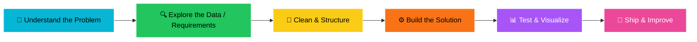

<div align="center">

# 🌟 Hey, I'm René 👋

### Data Explorer • App Builder • Problem Solver 🧠⚡


<br/>

<a href="https://www.linkedin.com/in/YOUR-LINKEDIN-USERNAME/">
  
</a>
<a href="mailto:YOUR_EMAIL@example.com">
  
</a>


</div>

---

## 🌍 About Me

> *“I like building things that make information easier to understand, use, and act on.”*

I’m René — a curious builder working across **data analysis**, **software development**, and **practical digital solutions**.  
My GitHub is where I experiment, learn in public, and turn ideas into working projects.

Currently exploring:

- 📊 Data analysis, dashboards, and insight storytelling
- 🧩 Clean project structure and maintainable code
- 🌐 Web apps and interactive tools
- 🧠 Problem-solving with Python, R, SQL, and modern development workflows
- 🚀 Building projects that are useful, readable, and presentable

---

## 🧭 How I Approach Projects

<div align="center">



</div>

Data is not just numbers. Code is not just syntax.  
The real work is connecting the dots until the result makes sense.

---

## 🛠️ My Technical Toolkit

<div align="center">

### 👩🏽‍💻 Programming & Analysis


### 📊 Data, Analytics & Visualization


### 🌐 Development Tools


</div>

---

## 🚀 Featured Projects

<table>
  <tr>
    <td width="50%">
      <h3>🚦 Trafficflowapp</h3>
      <p>An app-style project focused on traffic flow analysis and practical visualization.</p>
      <a href="https://github.com/Rene12-3/Trafficflowapp">View Repository →</a>
    </td>
    <td width="50%">
      <h3>📉 Fiscal-deficit-app</h3>
      <p>A data-centered application exploring fiscal deficit patterns and communication.</p>
      <a href="https://github.com/Rene12-3/Fiscal-deficit-app">View Repository →</a>
    </td>
  </tr>
  <tr>
    <td width="50%">
      <h3>📚 Maktaba System</h3>
      <p>A system-building project that shows backend/product thinking and organization.</p>
      <a href="https://github.com/Rene12-3/maktaba_system">View Repository →</a>
    </td>
    <td width="50%">
      <h3>📊 10ANALYTICS</h3>
      <p>Analytics practice and exploration — a space for sharpening insight work.</p>
      <a href="https://github.com/Rene12-3/10ANALYTICS">View Repository →</a>
    </td>
  </tr>
</table>

---

## 🧠 Problem-Solving Flow

```text
🎯 Start with the right question
   ↓
🔍 Find patterns, gaps, and signals
   ↓
🧹 Clean what is messy
   ↓
⚙️ Build something that works
   ↓
📊 Explain it clearly
   ↓
🚀 Improve from feedback
```

I don’t just want projects that run.  
I want projects that are clear, useful, and easy for someone else to understand.

---

## 📊 GitHub Analytics

<div align="center">


<br/>
<br/>


<br/>
<br/>


</div>

---

## 🌱 Currently Growing In

- Building cleaner, more professional GitHub projects
- Writing better README files and documentation
- Turning data into stories people can understand
- Creating portfolio-ready apps and dashboards
- Improving consistency, one commit at a time

---

## 🤝 Let’s Connect

<div align="center">

If you care about building useful things with data and code, we already speak the same language.  

<br/>

💼 [Connect on LinkedIn](https://www.linkedin.com/in/YOUR-LINKEDIN-USERNAME/) &nbsp; | &nbsp;
📧 [Email Me](mailto:YOUR_EMAIL@example.com) &nbsp; | &nbsp;
🌍 Building from Kenya, collaborating globally

<br/>
<br/>

> *“Good code solves a problem. Great code tells the next person what problem it solved.”* ✨

</div>

---

<div align="center">

⭐ Don’t forget to star a repository if you find something interesting!

</div>


